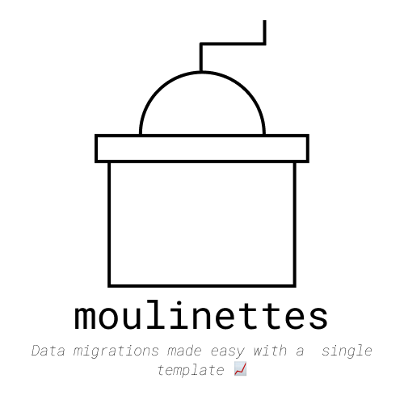

# Moulinettes

<div align="center">
  
  <p align="center">A simple template to run any data migrations within your Rails app.</p>
</div>


## Installation

Add this line to your application's Gemfile:

```ruby
gem "moulinettes"
```

## Usage

Generate a new moulinette using the generator:

```bash
  # Both syntaxes are valid and will generate the same file
  bundle exec rails g moulinettes:moulinette MyMoulinette 
  bundle exec rails g moulinettes:moulinette my_moulinette 
```

This will generate a new file in `lib/tasks/moulinettes` using the [template provided in the gem](lib/generators/moulinettes/yyyymmdd_action_of_a_moulinette_task.rake).

You can then run the task using the following command:

```bash
  bundle exec rails moulinettes:my_moulinette
```
